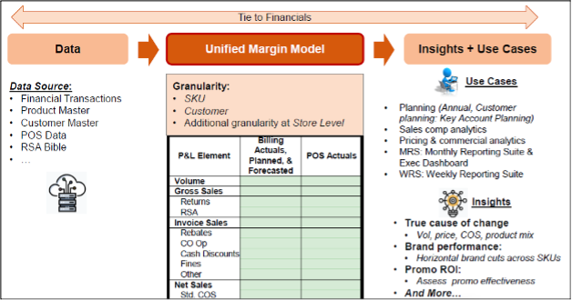
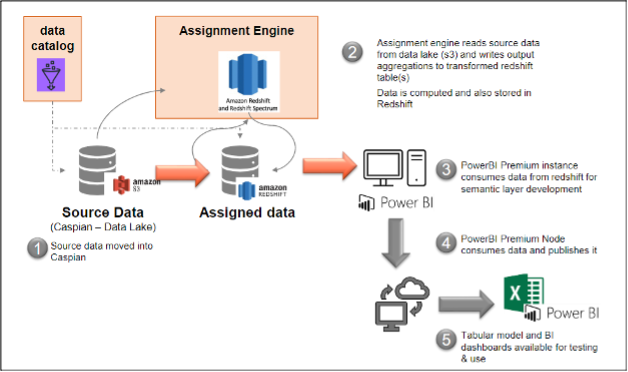

# Unified Margin North America Model (`UMM-NA`)

## Revision History

## Overview

The Unified Margin Model (UMM) solution is designed to combine customer and SKU data with financial data to create a unified model to support various analytics and reporting efforts within Stanley Black & Decker (SBD).



The current architecture includes the following components:
-	Source data from the Caspian data lake (in Snowflake) along with various reference data sets (from Excel and other sources)
-	An allocation engine designed to assign missing values (customer, product, etc.) where the level of granularity is not sufficient, or the data is missing
-	A dimensional model consisting of standard dimension and fact tables populated by the allocation engine (stored in Redshift)
-	A Power BI data model based on the dimensional model, used to provide end user access to the data via Excel, Power BI, or other tools

The Unified Margin Model (UMM) solution is designed to combine customer and SKU data with financial data to create a unified model to support various analytics and reporting efforts within Stanley Black & Decker (SBD). The current architecture includes a dimensional model built and maintained within Redshift. This model includes dimension and fact tables and is populated based on a set of stored procedures (executed by Talend jobs) that use several reference and staging tables as part of the load process.

The figuee below shows the overall architecture in Redshift before migration to Snowflake.



#### Source Systems used by UMM

1. BODS
2. SAPC11
3. SAPP10
4. SAPBW
5. LAWSONMAC
6. SAPE03
7. SFTPGTSI


## Source Data

The  UMM NA model uses source data extracts from Hyperion and various ERP systems, including SAP and Lawson.  Each of these data extracts are loaded into either S3 storage or Redshift via various processes and procedures created by the SBD-IT organization. In addition to these extracts, the UMM NA model also relies on various sets of reference data, used to load dimension tables for the model or used to assist with logic inside the assignment (or allocation) engine. The following lists the reference data sets used by the model:
<ol>
<li>bods.c11_0customer_attr_current</li>
<li>bods.c11_0ec_pca3_current</li>
<li>bods.c11_0material_attr_current</li>
<li>bods.drm_customer_current</li>
<li>bods.drm_product_current</li>
<li>bods.extr_lawson_mac_cust_current</li>
<li>bods.extr_lawson_mac_prod_current</li>
<li>bods.hfm_vw_hfm_actual_trans_current</li>
<li>bods.lawson_mac_pl_trans_current</li>
<li>bods.p10_0ec_pca_3_trans_current</li>
<li>sapc11.keko_current</li>
<li>sapc11.keph_current</li>
<li>sapc11.kna1_current</li>
<li>sapc11.knvh_current</li>
<li>sapc11.makt_current</li>
<li>sapc11.mara_current</li>
<li>sapc11.marm_current</li>
<li>sapc11.mbew_current</li>
<li>sapc11.t001_current</li>
<li>sapc11.t001k_current</li>
<li>sapc11.t023t_current</li>
<li>sapc11.t023t_current brnd</li>
<li>sapp10.kna1_current</li>
<li>sapp10.knvh_current</li>
<li>sapp10.makt_current</li>
<li>sftpgtsi.rsabible_current</li>
<li>s3://sbd-caspian-sandbox-staging/GTS_UMM/dim_date/date_table.csv</li>
<li>s3://sbd-caspian-sandbox-staging/GTS_UMM/commercial_hierarchy/sbd_mgmt_reporting_structure_draft_20210413.csv</li>
<li>s3://sbd-caspian-sandbox-staging/GTS_UMM/demand_group_to_bar_customer_mapping.csv</li>
<li>s3://sbd-caspian-sandbox-staging/GTS_UMM/entity_to_plant_to_division_mapping/entity_to_plant_to_division_to_sbu_mapping.csv</li>
<li>s3://sbd-caspian-sandbox-staging/GTS_UMM/commercial_hierarchy/product_commercial_hierarchy_20210416.csv</li>
<li>s3://sbd-caspian-sandbox-staging/GTS_UMM/product_hierarchy_allocation_mapping/fy2020/ProductHierarchyAllocationMappingfy2020.csv</li>
<li>s3://sbd-caspian-sandbox-staging/GTS_UMM/product_hierarchy_allocation_mapping/fy2021/ProductHierarchyAllocationMappingfy2021.csv</li>
<li>s3://sbd-caspian-sandbox-staging/GTS_UMM/bnr_extract/cal_act_umm.txt</li>
<li>s3://sbd-caspian-sandbox-staging/GTS_UMM/bnr_extract/hyperion_202104.csv</li>
<li>s3://sbd-caspian-sandbox-staging/GTS_UMM/bnr_extract/hyperion_202105.csv</li>
<li>s3://sbd-caspian-sandbox-staging/GTS_UMM/bnr_extract/hyperion_202106.csv</li>
<li>s3://sbd-caspian-sandbox-staging/GTS_UMM/bnr_extract/hyperion_202107.csv</li>
<li>s3://sbd-caspian-sandbox-staging/GTS_UMM/bnr_extract/hyperion_202108.csv</li>
<li>s3://sbd-caspian-sandbox-staging/GTS_UMM/bnr_extract/HYPERION_ACT_202110.txt</li>
<li>s3://sbd-caspian-sandbox-staging/GTS_UMM/bnr_extract/HYPERION_ACT_202111.txt</li>
<li>s3://sbd-caspian-sandbox-staging/GTS_UMM/bnr_extract/HYPERION_ACT_202112.txt</li>
<li>s3://sbd-caspian-sandbox-staging/GTS_UMM/bnr_extract/cal_act_umm.txt</li>
<li>s3://sbd-caspian-sandbox-staging/GTS_UMM/bnr_extract/hyperion_202104.csv</li>
<li>s3://sbd-caspian-sandbox-staging/GTS_UMM/bnr_extract/hyperion_202105.csv</li>
<li>s3://sbd-caspian-sandbox-staging/GTS_UMM/bnr_extract/hyperion_202106.csv</li>
<li>s3://sbd-caspian-sandbox-staging/GTS_UMM/bnr_extract/hyperion_202107.csv</li>
<li>s3://sbd-caspian-sandbox-staging/GTS_UMM/bnr_extract/hyperion_202108.csv</li>
<li>s3://sbd-caspian-sandbox-staging/GTS_UMM/bnr_extract/HYPERIONACT202109.txt </li>
<li>s3://sbd-caspian-sandbox-staging/GTS_UMM/bnr_extract/HYPERION_ACT_202110.txt</li>
<li>s3://sbd-caspian-sandbox-staging/GTS_UMM/bnr_extract/HYPERION_ACT_202111.txt</li>
<li>s3://sbd-caspian-sandbox-staging/GTS_UMM/bnr_extract/HYPERION_ACT_202112.txt</li>
</ol>

All these data sets must be available and complete (with no data duplication, missing data, corrupted data, etc.) for the UMM NA model to be loaded correctly and completely on a weekly basis.
* Note: The files listed above that are being loaded from S3 storage are available via slightly different URL paths in the PreProd and Prod environments.


## Assignment (or Allocation) Engine

One of the primary goals of the UMM NA model is to bring together financial data and transactional data to create a model that provides margins (standard and adjusted) at the product SKU and customer “ship to” and “sold to” levels of granularity.  To do this, the model uses an assignment (or allocation) engine to compensate for transactional data that may be missing critical levels of detail.  For example, some transactions may not correctly record the product sold down to the SKU level or record the customer down to the “ship to” and “sold to” level. In those cases, the allocation engine uses a set of rules to assign product and customer information as closely as possible.
The allocation engine currently uses three different types of rules:

<ul>
    <li>Rules used to map missing information</li>
    <li>Rules used to handle specific account exceptions or other cleansing requirements</li>
    <li>Rules used when AGM (adjusted gross margin) is calculated after SGM (standard gross margin)</li>
</ul>

## Assigned (or Allocated) Data

Once the allocation engine rules have been applied, the resulting data is loaded into the final model (using the dimension and fact tables in the “dw” schema in Redshift).  Details related to the Redshift data model (and related reference and staging tables used by the load process and the allocation engine) are detailed in a separate UMM NA Redshift Database Design document.

The tables show these sets of rules and what they are intended to handle.

*Table 1 - Allocation Rules for Missing Information*

| **Rule ID** | **Rule Description**                                                                                                  | **Missing Sold To** | **Missing SKU** | **Missing BA&R Customer** | **Missing BA&R Product** | **Missing BA&R Brand** |
| ----------- | --------------------------------------------------------------------------------------------------------------------- | ------------------- | --------------- | ------------------------- | ------------------------ | ---------------------- |
| 1           | Perfect data, no allocation needed                                                                                    |                     |                 |                           |                          |                        |
| 2           | Map sold to information to BA&R customer                                                                              |                     |                 | Y                         |                          |                        |
| 3           | Map SKU information to BA&R product                                                                                   |                     |                 |                           | Y                        |                        |
| 4           | Map SKU information to BA&R brand                                                                                     |                     |                 |                           |                          | Y                      |
| 5           |                                                                                                                       |                     |                 |                           |                          |                        |
| 6           | Missing all customer and product information; replace with “Unknown”                                                  | Y                   | Y               | Y                         | Y                        |                        |
| 7           | Missing all customer information and SKU; replace customer with “Unknown” and map BA&R product to SKU                 | Y                   | Y               | Y                         |                          |                        |
| 8           | Missing all product information and sold to; replace product with “Unknown” and map BA&R customer to sold to          | Y                   | Y               |                           | Y                        |                        |
| 9           | Missing sold to and SKU; map BA&R information to each accordingly                                                     | Y                   | Y               |                           |                          |                        |
| 10          | Missing all customer information and BA&R product; replace customer with “Unknown” and map SKU to BA&R product        | Y                   |                 | Y                         | Y                        |                        |
| 11          | Missing all customer information; replace with “Unknown”                                                              | Y                   |                 | Y                         |                          |                        |
| 12          | Missing sold to and BA&R product; map BA&R customer to sold to and map SKU to BA&R product                            | Y                   |                 |                           | Y                        |                        |
| 13          | Missing sold to; map BA&R customer to sold to                                                                         | Y                   |                 |                           |                          |                        |
| 14          | Missing all production information and BA&R customer; replace product with “Unknown” and map sold to to BA&R customer |                     | Y               | Y                         | Y                        |                        |
| 15          | Missing BA&R customer and SKU; map sold to to BA&R customer and map BA&R product to SKU                               |                     | Y               | Y                         |                          |                        |
| 16          | Missing all product information; replace with “Unknonwn”                                                              |                     | Y               |                           | Y                        |                        |
| 17          | Missing SKU; map BA&R product to SKU                                                                                  |                     | Y               |                           |                          |                        |
| 18          | Missing BA&R customer and product; map sold to to BA&R customer and map SKU to BA&R product                           |                     |                 | Y                         | Y                        |                        |
| 19          | Missing BA&R customer; map sold to to BA&R customer                                                                   |                     |                 | Y                         |                          |                        |
| 20          | Missing BA&R product; map SKU to BA&R product                                                                         |                     |                 |                           | Y                        |                        |

*Table 2 - Allocation Rules for Account Exceptions and Special Cleansing*

| **Rule ID** | **Rule Description**                                                                                 |
| ----------- | ---------------------------------------------------------------------------------------------------- |
| 21          | Handle account exceptions in the FOB Invoice Sales account                                           |
| 22          | Handle account exceptions in the Royalties Revenue account                                           |
| 23          | Handle account exceptions in the RSA and Price Adjustments accounts                                  |
| 24          | \*\* Not used \*\*                                                                                   |
| 25          | \*\* Not used \*\*                                                                                   |
| 26          | Handle account exceptions in the FOB Standard Material Costs account                                 |
| 27          | Special cleansing rules for BA&R customer and product values of “Customer\_None” and “Product\_None” |
| 28          | Special cleansing rules for “OTH” and “PSD\_oth” values                                              |

*Table 3 - Allocation Rules for AGM Calculations (after SGM is Complete)*

| **Rule ID** | **Rule Description**                                                                                |
| ----------- | --------------------------------------------------------------------------------------------------- |
| 100         | Handle allocation rules for Reported Inventory Adjustments (AGM calculations after SGM is complete) |
| 101         | Handle allocation rules for Reported Warranty Costs (AGM calculations after SGM is complete)        |
| 102         | Handle allocation rules for Reported Duty / Tariffs (AGM calculations after SGM is complete)        |
| 103         | Handle allocation rules for Reported Freight (AGM calculations after SGM is complete)               |
| 104         | Handle allocation rules for Reported PPV (AGM calculations after SGM is complete)                   |
| 105         | Handle allocation rules for Reported Labor/OH (AGM calculations after SGM is complete)              |


## Power BI Tabular Model

The data warehouse model populated within Redshift is not made available for end-user access. Instead, a Power BI tabular model is loaded once all assigned data is available in the Redshift model. The Power BI tabular model contains a complete set of dimensions (with various hierarchies) based on the dimension tables in the database and a full list of measures (organized into different groups and hierarchies) based on the fact tables. Full details regarding the Power BI tabular model are detailed in a separate UMM NA Power BI Tabular Model Design document.


## Dimensional Model

The  UMM NA dimensional model consists of the following dimension and fact tables, located within the dw schema in the gtsfpa database:

<li>dim_business_unit</li>
<li>dim_currency</li>
<li>dim_customer</li>
<li>dim_dataprocessing_outcome</li>
<li>dim_dataprocessing_rule</li>
<li>dim_product</li>
<li>dim_scenario</li>
<li>dim_source_system</li>
<li>dim_transactional_attributes</li>
<li>fact_pnl_commercial_stacked</li>
<li>fact_pnl_ocos_stacked</li>


Each of the fact tables has foreign-key to primary-key relationships to the dimension tables as needed. The following two diagrams show the entity-relationships between each of the fact tables and the dimension tables (showing the foreign-key column used for each).

## Reference Data and Staging Tables

To load the dimension and fact tables listed above, the UMM NA solution uses a set of stored procedures (orchestrated by Talend jobs available within the Talend Management Console) to pull data from various sources (tables available in other schemas in the database or available as files in S3) and manipulate that data to get it ready to load into the dimensional model. These reference data and staging tables are located within the ref_data and stage schemas in the gtsfpa database.  The stored procedures used are located in the dw schema and those two schemas, typically residing in the schema containing the destination tables they will each affect.


#### Common dbt commands

```
###Since SBD uses private repos for its code,

### Make sure ssh agent is running - git stuff for local machine
ssh-add -l

### Incase ssh agent is down, bring it back up - git stuff for local machine
eval $(ssh-agent)

### incase ssh agent is not running - add your private ssh key
ssh-add ~/<private key location>

### list added keys
ssh-add -l

## Test connection to bitbucket
ssh -T git@bitbucket.org

### clone the sbd_caspian_dbt_dif
git clone git@bitbucket.org:sbddatalake/sbd_caspian_dbt_dif.git

##checkout build branch
git checkout rehydrate/<env>/build/<rehydrate_build_task_name>

##checkout release branch
git checkout rehydrate/<env>/<source>

##create an environment var - pointing to your SBD rehydrate profile for DEV
export DEV_REHYDRATE= <user_dev_prefered_location>/.dbt_sbd_rehydrate

##create an environment var - pointing to your SBD rehydrate profile for TEST
export TEST_REHYDRATE= <user_test_prefered_location>/.dbt_sbd_rehydrate

##create an environment var - pointing to your SBD rehydrate profile for PROD
export PROD_REHYDRATE= <user_prod_prefered_location>/.dbt_sbd_rehydrate

## test connection to Snowflake SBD with the rehydrate profile
dbt debug --profiles-dir=$DEV_REHYDRATE

### Seed project/repo/ files to snowflake with full refresh
dbt seed --full-refresh --profiles-dir=$DEV_REHYDRATE

### Run tests
dbt test --profiles-dir=$DEV_REHYDRATE

## Get the project dependencies
dbt deps --profiles-dir=$DEV_REHYDRATE

## Generate document
dbt docs generate --profiles-dir=$DEV_REHYDRATE

## Serve the dbt document
dbt docs serve --profiles-dir=$DEV_REHYDRATE

### Compile
dbt compile --profiles-dir=$DEV_REHYDRATE

### Run a DBT commands
####Scenario - 5 : Processing of Deltas (Insert & Updates)
####to run the first time as full load
dbt run --vars '{"process_dt": "2021-10-02", "stage_name": "landing_stage", "source_name": "customers"}'  --model tag:"customers" --full-refresh  --profiles-dir=$DEV_REHYDRATE

####to run the second time as incremental
dbt run --vars '{"process_dt": "2021-10-03", "stage_name": "landing_stage", "source_name": "customers"}'  --model tag:"customers" --profiles-dir=$DEV_REHYDRATE

####Scenario - 2 : Processing of Deltas (Insert & Updates) & Delete file
####to run the first time as full load
dbt run --vars '{"process_dt": "2021-10-02", "stage_name": "landing_stage", "source_name": "products"}'  --model tag:"products" --full-refresh --profiles-dir=$DEV_REHYDRATE

####to run the second time as incremental
dbt run --vars '{"process_dt": "2021-10-03", "stage_name": "landing_stage", "source_name": "products"}'  --model tag:"products" --profiles-dir=$DEV_REHYDRATE

####to generate documentation
dbt docs generate --var '{"stage_name":"", "file_name":"", "process_dt":""}' --profiles-dir=$DEV_REHYDRATE

#### To check source freshness for older version of DBT - enabled for landing table
dbt source snapshot-freshness --profiles-dir=$SBD_PROFILE

#### To check source freshness for newer version of DBT >0.21.0
dbt source freshness --profiles-dir=$SBD_PROFILE

dbt run -m tag:zone0 --vars '{"skip_populate_into_z0": true, "load_latest_full_load": "true"}'

dbt run -m tag:zone0 --vars '{"skip_copy_into_z0": true, "load_latest_full_load": "true"}' --full-refresh

dbt run -m tag:quarantine --vars '{"skip_dataset_validation_checks": "data type check"}' --full-refresh

dbt run -m tag:validation --full-refresh

dbt run -m tag:zone1 tag:zone2 tag:zone3 --full-refresh

```


### Resources:
- Learn more about dbt [in the docs](https://docs.getdbt.com/docs/introduction)
- Check out [Discourse](https://discourse.getdbt.com/) for commonly asked questions and answers
- Join the [chat](http://slack.getdbt.com/) on Slack for live discussions and support
- Find [dbt events](https://events.getdbt.com) near you
- Check out [the blog](https://blog.getdbt.com/) for the latest news on dbt's development and best practices
